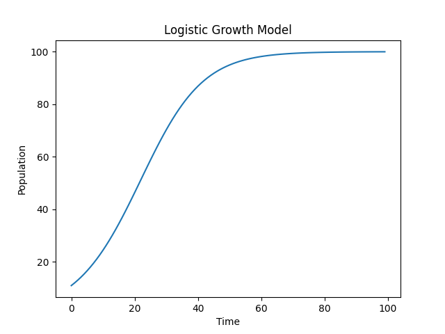

# 📈 Population Growth Modelling using Logistic Equation

## 📌 Overview

This project models how a population grows over time when resources are limited. Unlike exponential growth, real-world populations cannot grow indefinitely due to constraints such as food, space, and environmental factors.

The model used in this project is the **Logistic Growth Model**, which captures this realistic behavior and produces an S-shaped growth curve.

---

## 🧠 Mathematical Model

The population growth is governed by the logistic differential equation:

dP/dt = rP(1 - P/K)

Where:

* **P** → Population at time t
* **r** → Growth rate
* **K** → Carrying capacity (maximum sustainable population)

---

## 💡 Intuition Behind the Model

* When population is small → growth is nearly exponential
* As population increases → resources become limited
* Growth slows down
* Eventually → population stabilizes at carrying capacity (K)

This results in a **sigmoid (S-shaped) curve**.

---

## ⚙️ Methodology

* The differential equation is solved numerically using an iterative approach
* At each time step:

  * Population change is calculated
  * Population is updated accordingly
* Simulation is implemented using Python

---

## 💻 Technologies Used

* Python
* NumPy
* Matplotlib

---

## 📊 Results

The simulation shows:

* Initial slow growth
* Rapid increase in population
* Gradual stabilization at carrying capacity

This behavior reflects real-world population dynamics.

---

## 🧪 Experiments

Different scenarios were tested by varying parameters:

* Increasing growth rate (r) → faster population rise
* Decreasing carrying capacity (K) → lower final population
* Changing initial population → affects early growth behavior

---

## 📌 Conclusion

The logistic model provides a simple yet powerful way to understand population dynamics under resource constraints. It demonstrates how mathematical modelling can be used to simulate and analyze real-world systems.

---

## 🚀 Future Improvements

* Add real-world data for validation
* Build interactive visualization using Streamlit
* Extend model to include multiple interacting populations

---

## 👨‍💻 Author

Archit Dubey
